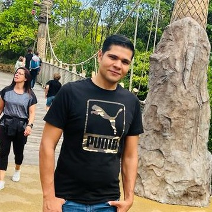

# ashraf poless

## Hello every body 👋

here is some information about **my group** 🤩 and **_me_**

[group2-Intro](https://github.com/HYF-Class22/group2-Intro)

I'm **Ashraf Poless** member of the _group-2_ who working together to finish
that wonderful project for week 1 workflow

### motivation

I'm so keen to learn how it goes when many people work together in the same
project, It kind of reflecting what gonna happened in the real life job

### Why did you build this project ?

it's workflow project which allow us to collaborate together ,

> our goal is learn how To work together.

- our group member
  - alasaidi
  - khantm02
  - adnanmalkic

> we are so enthusiastic for the first project

In simple words, we can describe this file as a guide that gives users a
detailed description of a project you have worked on.
